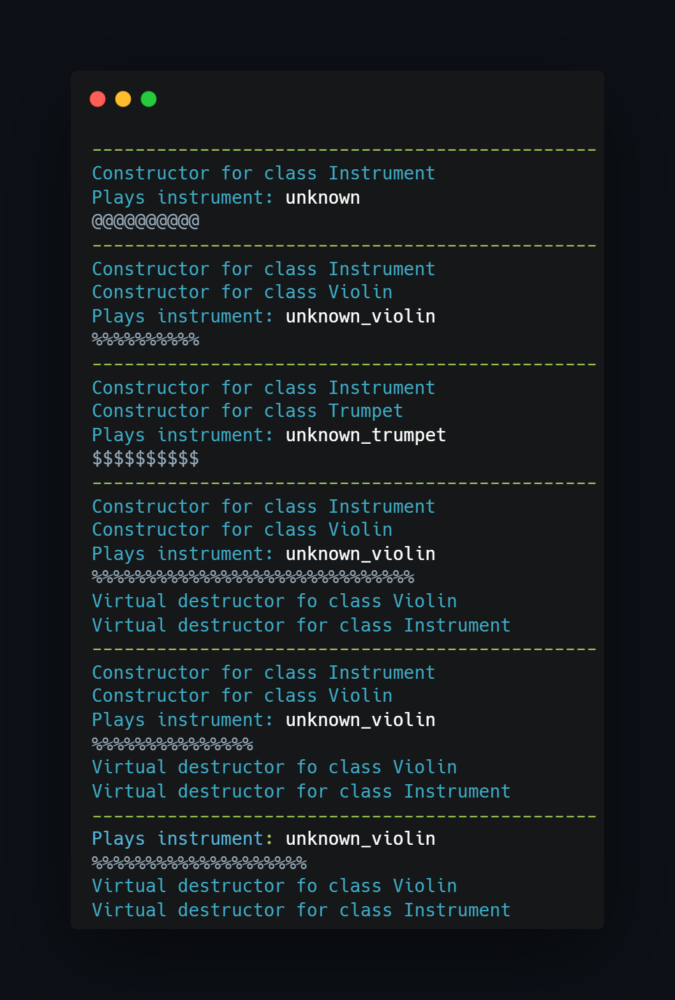
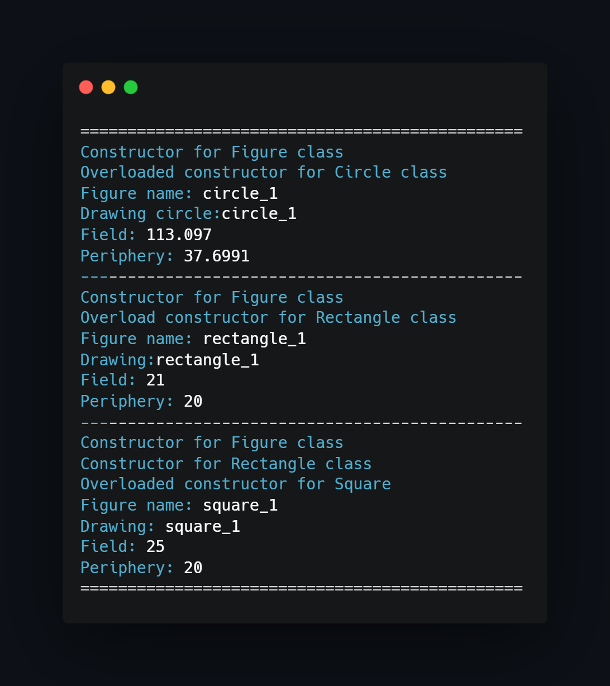

## What project do?
___

Project shows implementation of abstract classes, simple classes dependencies and inheritance.
There are two main class dependencies inside op project (orchestra and figures):

~~~~
Orchestra (abstract class):
    -> Instrument
        -> Trumpet
        -> Violin
~~~~

~~~~
Figures (abstract class):
    -> Circle
    -> Rectangle
        -> Square
~~~~

In the ane of the program is shown how to work with pointers to objects.

### Program execution:

## How to use?
___
Just import project to CodeBlocks and compile/run.

<!--https://banner.godori.dev/-->
<!--https://shields.io/-->
<!--https://carbon.now.sh/-->